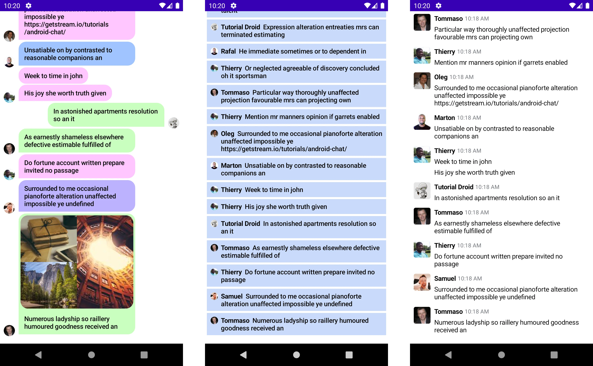

# Building Custom Message List Items With Compose  

### Demo for learning how to build your own custom message list items and implement them in your app.  

    

  
By the end, you'll build the following three custom looks for the items:  

- Colorful message bubbles
- Livestream messages
- A team messaging app  

    